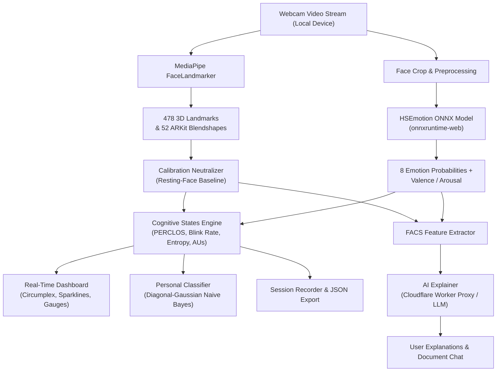

# Live Facial Expression & Cognitive State Reader

[](https://www.typescriptlang.org/)
[](https://vitejs.dev/)
[](https://developers.google.com/mediapipe)
[](https://onnxruntime.ai/)
[](https://www.apache.org/licenses/LICENSE-2.0)
[](https://github.com/eMohan07/Facial_Expression)

> **Real-time, edge-computed facial expression analysis, scientific cognitive state estimation, and FACS-grounded AI explanations running 100% locally in your browser.**

---

## Overview

The **Live Facial Expression & Cognitive State Reader** is an advanced browser-based computer vision and affective computing platform. It combines real-time deep learning inference (via **MediaPipe** and **ONNX Runtime Web**) with psychological and cognitive models to detect emotions, measure continuous affect (valence & arousal), estimate cognitive states (drowsiness, focus, stress, confusion), and provide AI-generated explanations grounded in the **Facial Action Coding System (FACS)**.

All camera video feeds are processed locally on the client's GPU/CPU. **No raw video or webcam frames ever leave the user's device.**

---

## Key Features

### 1. Dual-Pipeline Facial Emotion Recognition
- **HSEmotion ONNX (`enet_b0_8_va_mtl`)**: Evaluates 8 universal emotional states: *Neutral, Happiness, Sadness, Surprise, Fear, Disgust, Anger, and Contempt*.
- **MediaPipe FaceLandmarker**: Tracks 478 high-precision 3D facial landmarks and 52 ARKit-compatible facial blendshapes at up to 60 FPS.
- **Continuous Valence & Arousal**: Real-time projection onto Russell's Circumplex Model with a dynamic 2-second fading vector trail.
- **Compound Emotions (DTM14)**: Automatically identifies blended emotions (e.g., *happily surprised*, *bittersweet*, *fearfully angry*) when secondary expression criteria are met.

### 2. Literature-Grounded Cognitive State Engine
Computes real-time psychological metrics using peer-reviewed physiological indicators:
- **Drowsiness & Fatigue**: **PERCLOS** (percentage of eye closure over time $\ge 0.15$) following NHTSA standards.
- **Visual Attention & Blink Dynamics**: Blink rate tracking ($\sim 0.25\text{ Hz}$ baseline) measuring cognitive load and strain.
- **Confusion Detection**: Sustained co-activation of Corrugator Supercilii (AU4) and Orbicularis Oculi (AU7).
- **Stress & Mental Workload**: Analysis of brow furrows, lip stretching (AU20), and lip pressing (AU24).
- **Engagement & Boredom**: Multimodal tracking combining gaze stability, head orientation, and expression entropy.
- **Calmness & Affect Lability**: Rolling calculation of valence flux ($V$-flux) and emotional equilibrium.

### 3. Personal Baseline Calibration
- Quick 3-second resting-face baseline capture.
- Neutralizes natural facial asymmetries, resting smile/frown tendencies, and user-specific physiological geometry to ensure accurate downstream classification.

### 4. Custom On-Device Classifier
- Interactive personal calibration module.
- Fits a client-side **Diagonal-Gaussian Naive Bayes** classifier to user samples in real time, allowing customized emotion triggers without cloud retraining.

### 5. FACS-Grounded AI Explainer & Productive Workspace
- **Explainable AI (XAI)**: Generates human-understandable explanations for detected emotions based on specific Action Units (AUs), blendshape deltas, and valence/arousal vectors.
- **Document Chat & Smart Notepad**: Integrates interactive document analysis and rich note-taking synchronized with cognitive states and emotional logs.
- **Recording & Analysis**: In-memory session buffer allowing recording up to 10 minutes of real-time expression telemetry, exportable as structured JSON for research and offline inspection.

---

## System Architecture



---

## Project Structure

```
Facial_Expression/
├── src/
│   ├── ai/
│   │   ├── explain.ts               # FACS prompt builder & AI explainer service
│   │   └── gemma-service.ts         # Lightweight local/auxiliary AI models
│   ├── ui/
│   │   ├── confidence-viz.ts        # Emotion probability & confidence meters
│   │   ├── document-chat.ts         # Interactive contextual document chat
│   │   ├── feature-dashboard.ts     # Real-time metrics and blendshape monitor
│   │   ├── notepad.ts               # State-synchronized smart notepad
│   │   └── valence-arousal-viz.ts   # Russell Circumplex 2D visualization
│   ├── calibration.ts               # 3-second resting-face calibration engine
│   ├── emotion-head.ts              # Emotion classification heads & aggregators
│   ├── emotion-onnx.ts              # HSEmotion ONNX runtime integration
│   ├── face-pipeline.ts             # MediaPipe FaceLandmarker orchestration
│   ├── gaze-tracker.ts              # Pupil tracking and gaze fixation engine
│   ├── main.ts                      # Application bootstrapping & rendering loop
│   ├── personal-classifier.ts       # On-device Diagonal-Gaussian Naive Bayes
│   ├── states.ts                    # Cognitive state engine (PERCLOS, stress, etc.)
│   └── vite-env.d.ts                # TypeScript Vite environment definitions
├── proxy/                           # Optional Cloudflare Worker for secure API proxying
│   ├── src/worker.ts                # Worker edge proxy with CORS and validation
│   ├── package.json
│   ├── tsconfig.json
│   └── wrangler.toml
├── public/                          # Static assets
├── index.html                       # Application interface and layout
├── package.json                     # Frontend dependencies and npm scripts
├── tsconfig.json                    # TypeScript compiler configuration
├── vite.config.ts                   # Vite bundler configuration
└── .env.example                     # Environment template
```

---

## Tech Stack

| Layer | Technology | Purpose |
|---|---|---|
| **Language** | [TypeScript](https://www.typescriptlang.org/) | Strongly typed, robust application logic |
| **Bundler & Dev Server** | [Vite](https://vitejs.dev/) | Ultra-fast HMR and optimized production build |
| **Vision & Landmarks** | [`@mediapipe/tasks-vision`](https://developers.google.com/mediapipe) | 478 3D facial landmarks & 52 blendshapes |
| **Neural Network Engine** | [`onnxruntime-web`](https://onnxruntime.ai/) | WebAssembly / WebGL accelerated client-side ONNX execution |
| **Deep Learning Weights** | [HSEmotion `enet_b0_8_va_mtl`](https://github.com/HSE-asavchenko/face-emotion-recognition) | Multi-task emotion and valence/arousal model |
| **Edge API Proxy** | [Cloudflare Workers](https://workers.cloudflare.com/) | Secure, keyless server-side proxy for AI explanations |
| **Styling** | Tailwind CSS & Modern Web APIs | Responsive, glassmorphic UI with canvas visualizations |

---

## Getting Started

### Prerequisites

- [Node.js](https://nodejs.org/) (version `18.x` or higher recommended)
- [npm](https://www.npmjs.com/) or [yarn](https://yarnpkg.com/) / [pnpm](https://pnpm.io/)
- A working webcam connected to your computer

### Installation

1. **Clone the repository:**
   ```bash
   git clone https://github.com/eMohan07/Facial_Expression.git
   cd Facial_Expression
   ```

2. **Install project dependencies:**
   ```bash
   npm install
   ```

3. **Configure Environment Variables:**
   ```bash
   cp .env.example .env.local
   ```
   *(Optional)* If testing AI explanations locally without the Cloudflare proxy, add your API key in `.env.local`:
   ```env
   VITE_DEMO_ANTHROPIC_API_KEY=your_test_key_here
   ```

4. **Start the local development server:**
   ```bash
   npm run dev
   ```
   Open [http://localhost:5173](http://localhost:5173) in your browser. Grant camera permissions when prompted.

---

## Production Build & Deployment

### Building the Frontend

Compile TypeScript and build the optimized production bundle:
```bash
npm run build
```
The output will be generated inside the `dist/` directory, ready to be hosted on any static hosting service (GitHub Pages, Vercel, Netlify, Cloudflare Pages, Hugging Face Spaces).

### Setting Up the Secure AI Proxy (Optional)

To enable the AI Explainer ("Why?", "Ask", "Summarize") in production without exposing API keys in client-side bundles:

1. Navigate to the `proxy` folder:
   ```bash
   cd proxy
   npm install
   ```
2. Log into Cloudflare Wrangler:
   ```bash
   npx wrangler login
   ```
3. Set your secret API key on Cloudflare:
   ```bash
   npx wrangler secret put ANTHROPIC_API_KEY
   ```
4. Deploy the worker:
   ```bash
   npx wrangler deploy
   ```
5. Set `VITE_EXPLAIN_PROXY_URL` in your frontend environment to the resulting Worker URL.

---

## Privacy & Security

- **Strictly Local Inference**: Webcam frames are analyzed locally in browser memory using WebAssembly / WebGL. No video, images, or raw biometric frames are transmitted to any server.
- **Privacy-Preserving Explanations**: When AI explanations are requested, only extracted numerical metrics (probabilities, blendshape activation values, and cognitive scores) are transmitted.
- **Zero Persistent Tracking**: All data is session-scoped by default. Persistent storage is strictly opt-in and can be purged immediately with the "Clear stored data" control.

---

## Scientific Foundations & Literature

The cognitive modeling in this repository is built upon established research:

- **PERCLOS Drowsiness Metric**: Wierwille et al. (1994), NHTSA Research Report; Dinges & Grace (1998), FHWA TB98-006.
- **Blink Rate & Cognitive Load**: Stern, Walrath & Goldstein (1984), *Psychophysiology*, 21:22–33; Maffei & Angrilli (2018), *Neurosci Lett*.
- **Confusion Detection via AU4 + AU7**: D'Mello & Graesser (2010), *Cognition & Emotion*, 24(1):67–76.
- **Boredom & Affect Flatness**: Craig, D'Mello, Witherspoon & Graesser (2008); D'Mello & Graesser (2010).
- **Stress & Anxiety Facial Action Units**: Harrigan & O'Connell (1996); Giannakakis et al. (2017), *Biomedical Signal Processing and Control*, 31:89–101.
- **Engagement Dynamics**: Whitehill et al. (2014), *IEEE Transactions on Affective Computing*, 5(1):86–98.
- **Circumplex Model of Affect & Valence Flux**: Russell, J. A. (1980), *Journal of Personality and Social Psychology*, 39(6):1161–1178; Kuppens et al. (2010, 2013), *Emotion*.
- **Compound Emotion Classification**: Du, S., Tao, Y., & Martinez, A. M. (2014), *PNAS*, 111(15):E1454–E1462.

---

## License

This project is licensed under the [Apache License 2.0](LICENSE).  
- MediaPipe Vision is distributed under the Apache-2.0 License.  
- HSEmotion models and weights are distributed under the Apache-2.0 License.  
- ONNX Runtime Web is distributed under the MIT License.

---

## Author

Developed and maintained by [Mohan (eMohan07)](https://github.com/eMohan07).